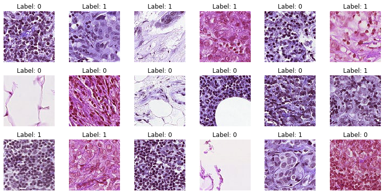

# Kaggle: Histopathologic Cancer Detection ([link](https://www.kaggle.com/c/histopathologic-cancer-detection/overview))

Data: 220 025 histopathologic scans of lymph node sections

Task: predict the probability that an image contains tumor tissue 

Evaluation: area under the ROC curve

Solution: simple 2D-CNN

Success: 0.942 AUC

